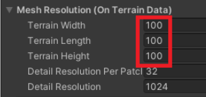

## The Unity Terrain object

You can create a terrain in Unity to provide a more interesting environment than a flat plane.

- Right-click in the Hierarchy window, select **3D Object** and then **Terrain**.

- In the Inspector, select the paint brush tool and then **Raise or Lower Terrain** from the drop-down menu.

- You can raise the terrain by left-clicking, or lower it by holding down shift and clicking. Changing brushes will change how the terrain is drawn.

- Clicking on the gear icon will allow you to add a material to your terrain.

- Clicking on the tree icon will allow you to paint trees onto your terrain. Click on the **Edit Trees** button.

- Click on **Add Tree** and in the window that opens use the circle button to add a tree from your assets.

- Use the brush to paint trees onto your terrain.

**Tip:** Adding a large terrain can slow down the processing speed of the game. To reduce the size of your terrain GameObject, naviagate to the 'Mesh Resolution' component and change the width, length, and height values. 

