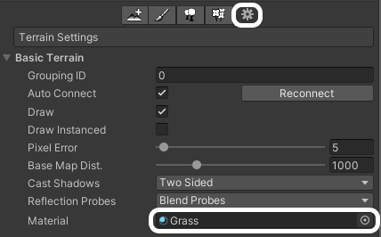

## L'objet Terrain d'Unity

Tu peux créer un terrain dans Unity pour offrir un environnement plus intéressant qu'un plan plat.

- Fais un clic droit dans la fenêtre Hierarchy, sélectionne **3D Object** puis **Terrain**.

- Dans l'Inspector, sélectionne l'outil pinceau puis **Raise or Lower Terrain** dans le menu déroulant.

- Tu peux élever le terrain en faisait un clic gauche sur ta souris, ou l'abaisser en maintenant la touche Shift enfoncée et en cliquant. Le fait de changer de pinceau modifie la façon dont le terrain est dessiné.

- En cliquant sur l'icône en forme d'engrenage, tu pourras ajouter un matériau à ton terrain.

- En cliquant sur l'icône Arbre, tu pourras peindre des arbres sur ton terrain. Clique sur le bouton **Edit Trees**.

- Clique sur **Add Tree** et dans la fenêtre qui s'ouvre, utilise le bouton cercle pour ajouter un arbre à partir de tes ressources.

- Utilise le pinceau pour peindre des arbres sur ton terrain.

**Astuce :** l'ajout d'un grand terrain peut ralentir la vitesse de traitement du jeu. Pour réduire la taille de ton GameObject terrain, va dans « Mesh Resolution » et modifie les valeurs de largeur (width), de longueur (length) et de hauteur (height).

