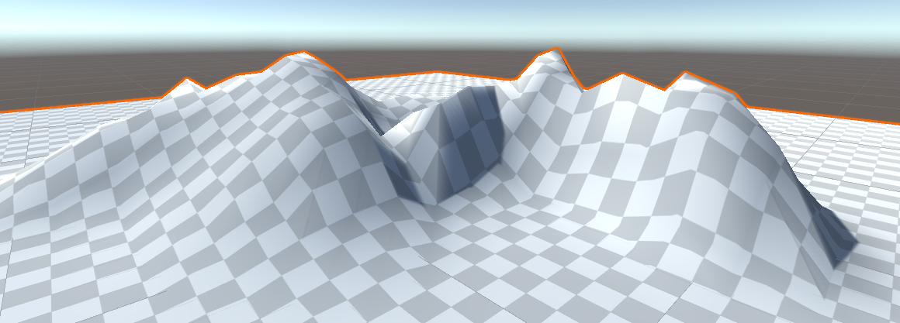

## Het Unity Terrain-object

Je kunt een terrein in Unity creëren om een interessantere omgeving te creëren dan een plat vlak.

- Klik met de rechtermuisknop in het Hierarchy venster, selecteer **3D-object** en vervolgens **Terrain**.

- Selecteer in het infovenster het penseelgereedschap en vervolgens **Raise or Lower Terrain** in het vervolgkeuzemenu.

- Je kunt het terrein verhogen door met de linkermuisknop te klikken, of verlagen door Shift ingedrukt te houden en te klikken. Door van penseel te veranderen, verander je de manier waarop het terrein wordt getekend.

- Door op het tandwielpictogram te klikken kun je een materiaal aan je terrein toevoegen.

- Door op het pictogram van de boom te klikken kun je bomen op je terrein tekenen. Klik op de knop **Edit Trees**.

- Klik op **Add tree** en in het venster dat opent gebruik je de cirkelknop om een boom uit je assets toe te voegen.

- Gebruik het penseel om bomen op je terrein te schilderen.

**Tip:** Het toevoegen van een groot terrein kan de verwerkingssnelheid van het spel vertragen. Om de grootte van je terrain GameObject te verkleinen, ga je naar de component 'Mesh Resolution' en wijzig je de waarden voor breedte (width), lengte (length) en hoogte (height).

